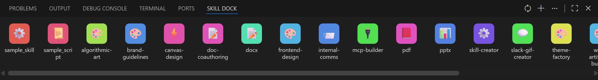

> 🌐 **中文 (Simplified Chinese)** | [English](./README.md)
> 
# 🚀 IDE Skill Dock


<p align="center"><i>IDE Skill Dock 界面可视化展示</i></p>

## 📝 插件简介

**IDE Skill Dock** 是一款专为带有 AI 功能的 IDE（如 VS Code, Cursor, Antigravity 等）开发的管理工具。该扩展支持以可视化的形式把 `SKILL.md` (Agent 提示词) 和本地的脚本程序集中管理。点击或拖拽界面上的图标，即可快速将包含绝对路径或定制指令的快捷方式输入到 AI 对话框中进行调用。

## 🛠️ 如何使用

### 1. 📥 如何安装
打开 VS Code （或受支持的衍生版本）中的 **Extensions (扩展)** 市场，搜索 **"IDE Skill Dock"** 下载并安装。安装完毕并重启/重载窗口后，活动栏或状态栏将出现相应的入口图标，点击即可打开面板。

### 2. ➕ 如何在 skill 界面中添加 skill 或脚本程序

插件有以下三种方式添加 skill 和脚本程序：

**(1) 🔄 选定 workspace + 同步（仅限 skill）：**
- 点击面板顶部的 **“设置”** 按钮（齿轮图标），选择 **“初始化工作区 (Init Workspace)”**。
- 选择一个作为工作目录的本地文件夹（该目录名是任意的，可包含各种您的项目/脚本子目录）。
- 选定后，点击主界面的 **“同步 (Sync)”** 按钮。插件会自动扫描该工作目录及其子目录，提取所有名为 `SKILL.md` 的文件并将其添加为面板中的 skill 图标。

**(2) ➕ 通过面板的 "+" 按钮，手动添加（可添加 skill 和脚本程序）：**
- 点击面板顶部的 **“添加”** 按钮（+号），系统弹出文件选择器。
- 你可以手动选择本机的任何 skill 文件或脚本程序文件（如 `.py`, `.js` 或者其他外部文档）。系统会以其原文件名立刻创建一个新图标。
- *(注 1：通过这种方式引入或直接写入 JSON 的手动图标，在下一次点击“同步”扫描工作目录时，也会被永久保留，不会因为它们不在当前 workspace 目录内而被清理掉。)*
- *(注 2：对于任何添加的脚本程序，强烈建议您为其配备相应的 **`.md` 格式说明性文件**。这可有效辅助所用 AI Agent 理解该脚本程序的用途和用法；否则，面对未知的空指令裸代码文件，Agent 可能需自行加载和扫描整个源码，从而造成不必要的 token 成本与资源浪费。)*

**(3) ✍️ 通过修改 `skills_registry.json`（可添加 skill 和脚本程序）：**
- 打开底层的 `skills_registry.json` 配置文件。在 `"skill": {}` 字典中可以手动插入符合结构的键值对（键名为 UI 渲染的图标名称）。例如：
```json
"my-awesome-skill": {
  "path": "C:\\path\\to\\your\\any_skill.md",
  "command": "使用 C:\\path\\to\\your\\any_skill.md 来完成任务"
},
"my-data-script": {
  "path": "C:\\path\\to\\your\\script.py",
  "command": "使用 C:\\path\\to\\your\\script.py 处理数据"
}
```
保存文件后，回到插件面板点击顶栏的“同步”刷新，新增的 skill 或脚本程序便会显示。

### 3. 🗑️ 如何在 skill 界面中移除 skill 图标或脚本程序图标

**(1) 🖱️ 鼠标右键点击图标的方法：**
- 在可视化面板直接将鼠标悬浮在你要移除的 skill 或脚本程序图标上。
- **点击鼠标右键**弹出上下文菜单，点击 **Remove** 选项，即可在面板内移除该项（同时会从 json 文件中删除并在本地连带清理该卡的 SVG 图片缓存）。

**(2) ✍️ 通过修改 `skills_registry.json`：**
- 手动打开配置文件，在 `"skill"` 下找到你想移除的 skill 或脚本程序对应的字典节点。
- 直接将该段键值区间**删除并保存**。UI 再次重新渲染或者点击“同步”后就会剔除该项目。

### 4. 🎛️ 如何为每个 skill 或脚本程序定制指令 (command)

这里的指令 (command) 指的是当你通过点击或拖拽特选图标时，实际输出并拷贝到剪贴板用来发给 AI 的那段纯文本句子。

**如何修改：**
- 点击面板顶部设置里的 **“编辑 skill 和 json 列表”**（或直接打开 `skills_registry.json`）。
- 找到对应的 skill 或脚本程序的字典，修改其中的 `"command"` 的值。
- 将其修改为你期望 AI 接收的专属要求提示说明并保存，比如：`根据这篇 C:\\path\\to\\SKILL.md 文档的指导意见，审阅我目前的代码`。

### 5. 🤖 如何在 IDE 的 AI 聊天框里使用

**(1) 💻 VS Code：**
- 点击面板上的 skill 或脚本程序的图标。
- 指令会被置入系统剪贴板，同时插件会自动对焦到如 Claude Code / GitHub Copilot 的聊天栏光标。
- 若焦点成功跳转，只需在输入框按 `Ctrl + V`（Windows）即可执行。

**(2) 🎨 Cursor 和 Antigravity：**
- 同样点击目标 skill 或脚本程序的图标。指令被存入系统剪贴板。
- 由于这些版本闭源逻辑或者高度修改了底层的入口机制，第三方插件受到安全隔离无法强制获取焦点跳转权限。
- 在此类产品下，你需要自行用鼠标点击 IDE 右侧 AI 对话面板中的聊天输入框，然后按下 `Ctrl + V` 进行粘贴执行。

**(3) 🌐 其他：**
- 暂未测试，您可以先尝试安装。后续大版本更新中将兼容并测试更多派生编辑器。

### 6. 🎨 如何修改界面外观

**(1) ⚙️ 通过界面的设置按钮：**
- 点击面板顶栏 **设置** -> **外观 (Appearance)**。
- 此时页面正上方将拉取下拉菜单，你可以选择：
  - `dark`: 深色背景（默认）。
  - `bright`: 明亮白背景。
  - `custom`: 弹出文件选择器，让你选择本机的任意一张图片（png/jpg 等）作为渲染背景。

**(2) ✍️ 通过修改 `skills_registry.json`：**
- 在 JSON 层级寻找 `"appearance": { "background": "dark" }` 节点。更改 `dark` 为 `bright` 或者是具体的本机绝对图片路径结构。保存后刷新即可。
- *(注：项目当前主线版本不涉及布局 (layout) 变更，若 JSON 内存有该残留项目，在下次更新中将被自动清理。)*

---

## 🎨 个性化 SVG 图标主题布置

当你同步或者添加一枚全新的 skill 或脚本程序后，如果没有默认给定的图片情况，插件会利用内置的一个简单哈希表映射分配一组 SVG 格式的底图颜色，并根据应用名称分配合适的 Emoji。

**默认的 svg 文件夹在系统里的绝对路径：**
因为 VS Code 大多将离线扩展储存在特定隐藏目录下，该 SVG 自动生成的首选落地目标位置为：
`C:\Users\【你的系统用户名】\.vscode\extensions\local.ide-skill-dock-0.0.1\media\default\`
*(如果是 Cursor 等，则可能相应挂载在 `.cursor\extensions\...` 目录下)*

如果你想自己定制皮肤，只需自行制作一张 `.icon.svg` 图片，将其严格命名为 `<名称>.icon.svg` 测试后放进上述绝对路径目录覆盖原图即可生效。

---

## 📂 配置文件介绍与管理

核心数据和微调逻辑均通过纯文本形态的 JSON 进行托管配置，它们的系统底层绝对存在路径同样位于：
`C:\Users\【你的系统用户名】\.vscode\extensions\local.ide-skill-dock-0.0.1\`

- **`skills_registry.json`**：
  插件的核心数据库。存储了各种功能图标所对应的本机绝对路径、你自定义的外观、工作目录配置，以及针对每个脚本重置过后的特定 `command` 记录大全。需要完全个性化的专属调用意图，请在这个底层里对选定程序的 `command` 字段进行修改。
- **`prompt_templates.json`**：
  该插件的默认 command 模板全局存放处。仅用于在未被手动设定过 `command` 的全新项目首次导入产生时，为其赋能一张基础的纯文本外套。

---

## 🛣️ 支持与版本规划

- **(1) 🪟 Windows 系统**：目前本插件原生支持绝大多数在 Windows 上运作的基础路径配置和互通层面的剪贴板操作。
- **(2) 🍎 Mac OS & Linux 发行版（如 Ubuntu）**：相关核心路径适配、换行等问题正在完善，将在后续更新版本中支持。

---

## 🔗 源码 & 联系我们

如果您在使用过程中遇到问题或者希望对项目开发做出贡献，可以通过访问下方的项目库地址向开发者提交 Issue 或 Pull Request：
[🔗 项目 GitHub 仓库地址](https://github.com/BingkangShi/ide-skill-dock)
